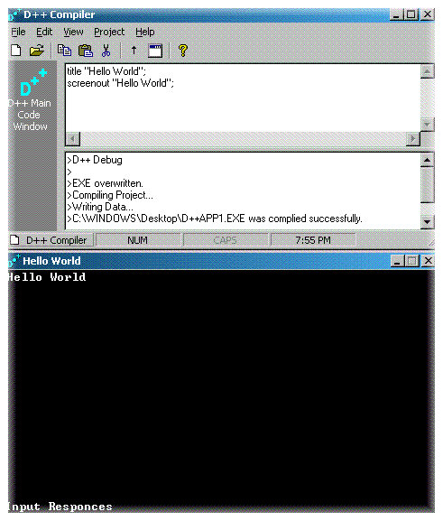



## D\+\+ Update\!\!\! Version 2\.0

### Description

Ok, this source code is a compiler that compiles the D++ language into an execuatable. There are commands like input and output, deleting files, message boxes, playing wav sounds, etc. The output of it is based in its own console. I am in the process of developing winsck support and more of a visual program. The program now automaticly locate your system folder and your desktop. PageMac made this, i just revised it. Vote for me if you like this code! Version 2.0
 
### More Info
 

             |
---                |---
**Submitted On**   |2000-08-16 19:47:04
**By**             |[AdamParker](https://github.com/Planet-Source-Code/PSCIndex/blob/master/ByAuthor/adamparker.md)
**Level**          |Intermediate
**User Rating**    |3.7 (52 globes from 14 users)
**Compatibility**  |VB 5\.0, VB 6\.0
**Category**       |[Miscellaneous](https://github.com/Planet-Source-Code/PSCIndex/blob/master/ByCategory/miscellaneous__1-1.md)
**World**          |[Visual Basic](https://github.com/Planet-Source-Code/PSCIndex/blob/master/ByWorld/visual-basic.md)
**Archive File**   |[CODE\_UPLOAD90208162000\.zip](https://github.com/Planet-Source-Code/adamparker-d-update-version-2-0__1-10736/archive/master.zip)

